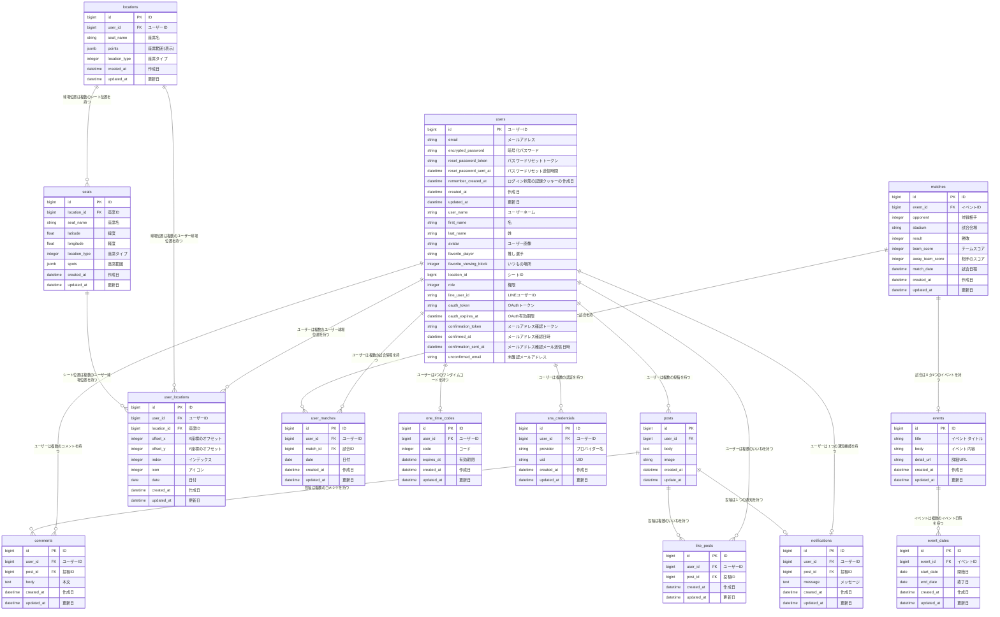

<h1>甲子園NOW！</h1>
<h4>サービスURL：<a href="https://kousiennow.onrender.com/">https://kousiennow.onrender.com/</a></h4>

甲子園NOWは、甲子園球場での観戦をより楽しくするためのSNSアプリです。 
今の興奮、感動を共有しよう！

<h2>■サービス概要</h2>

甲子園球場の盛り上がりや興奮を文字と画像で投稿でき、コメントやいいね機能もあるので、ユーザー同士の交流ができます。 
自分の投稿にコメントが来たときは、LINE通知がくるように設定できます。 
位置情報にアイコンを一緒に登録することができ、今日の観戦位置をユーザー同士で共有することができます。 
また、観戦カレンダーでは試合、イベント情報の閲覧と、自身の観戦予定の登録、履歴の閲覧が可能です。

 

<h2>■機能一覧</h2>
・ユーザー登録　( gem devise ) 
・いいね・コメント機能　( turbo ) 
・位置情報登録機能　（ GeolocationAPI、Javascript ） 
・アイコンの表示機能　（　turbo、Javascript　） 
・カレンダー機能　（ gem simple_calendar ） 
・コメント通知機能　（　line-bot-api　） 
・OmniOAuth認証機能　（　Google+ API、LINEログイン　） 
 

<h2>■このサービスへの思い・作りたい理由</h2>

甲子園球場での観戦中、試合の盛り上がりを近場の方々だけでなくもっと広い範囲で、甲子園球場全体のファンの方々と共有したいと思った経験から、このサービスを思いつきました。 
観戦しているときに、隣の席の人との会話が盛り上がったり、SNSで「今ここにいる！」と共有したりする楽しさをアプリで提供したいと思いました。

 

<h2>■他のSNSとの差別化</h2>

X : リアルタイムでのシェアに特化していますが、位置情報やアイコンなどは使用できません。

Instagram: 位置情報は表示できますが、文章のみの表示になり、投稿もリアルタイム性に欠けストーリーも1日で消えてしまいます。

上記の欠点を補う新しいSNSサービスとして、甲子園NOWは登場します。 
位置情報画面を一覧で表示できるようにして、実際の甲子園の盛り上がりが目視でき、ファン同士のコミュニケーションの場として活躍できるアプリです。

 

<h2>■ユーザー層について</h2>

甲子園球場で観戦するファン: 
理由: 球場内でのリアルタイムな交流を促進し、甲子園観戦での同じファンとの交流という野球観戦においての楽しみを増やすため。

SNS好きの若年層: 
理由: リアルタイムでの位置情報付き投稿や、いいね・コメント機能で、SNS感覚で楽しめるため。 
また、ビールやチューハイ、カレーやたこ焼きなどのアイコンを使った投稿機能で、観戦の楽しさを共有できるため。

阪神タイガースファン： 
理由：　タイガースファンならわかるはず。

 

<h2>■ユーザーの獲得について</h2>

身近な阪神ファンに向けて:
まず初めに使ってみてもらい、フィードバックをいただく。その後、SNSでの告知や口コミに移行する。

SNSでのユーザー獲得:
若年層にリーチするため、TwitterやInstagramで阪神ファンの方に触ってもらう。

口コミ:
利用者がアプリの楽しさを共有し、自然な形で利用者を増やす。

 

|機能の実装方針| |
|---|---|
|技術スタック|開発環境: Docker|
|サーバサイド|Ruby on Rails 7系: 高速な開発サイクルを提供。
| |Ruby 3.2.2|
| |Rails 7.0.4.3|
|フロントエンド|ERBファイルを使用したHTML: フロントエンドはシンプルに黄色と黒で構成。|
| |JavaScript|
| |CSSフレームワーク:|
| |Bootstrap 5系: レスポンシブデザインを実装し、ユーザービリティを意識したシンプルなデザインを採用。|
|WebAPI|Google Maps API: 投稿に位置情報を追加。
| |LINE Messaging API: コメント通知を送信。|
| |OpenWeather API: 天気情報の取得。|
| |Google+ API: Googleログイン認証|
| |LINEログイン：　LINEログイン認証|
|画像アップロード|ActiveStorage: 画像のアップロード機能を提供。|
|インフラ|Webアプリケーションサーバ: Render|
| |ファイルサーバ: Amazon S3|
|その他|VCS: GitHub|
 

画面遷移図：　<a href="https://www.figma.com/board/I7TWuNN9Id1z2tpi35RQI0/%E7%84%A1%E9%A1%8C?node-id=0-1&t=HprCttfLc6lzSBqo-0">https://www.figma.com/board/I7TWuNN9Id1z2tpi35RQI0/%E7%84%A1%E9%A1%8C?node-id=0-1&t=HprCttfLc6lzSBqo-0</a>
 
ER図：　

 
 

|機能紹介動画| |
|---|---|
| トップ画面 | 位置情報登録機能 |
|||
|今日の試合情報、ユーザーの現在位置、最新の投稿が一目で確認できます。|位置情報を登録するから、現在位置を取得し、該当の座席名を表示します。自宅から応援も可能です。|
| | |
| 新規投稿機能 | アイコンから投稿の取得、ユーザー詳細 |
|||
|虎に熱い声援を送るから、新規投稿ができます。|甲子園球場上のアイコンをクリックしたら投稿が現れます。投稿ユーザーの名前をクリックすると、そのユーザーのページにリンクします。|
| | |
|観戦カレンダー|コメント機能|
|||
|試合、イベント情報の閲覧と自身の観戦履歴を登録することができます。|他のユーザーの投稿にコメントができます。|
